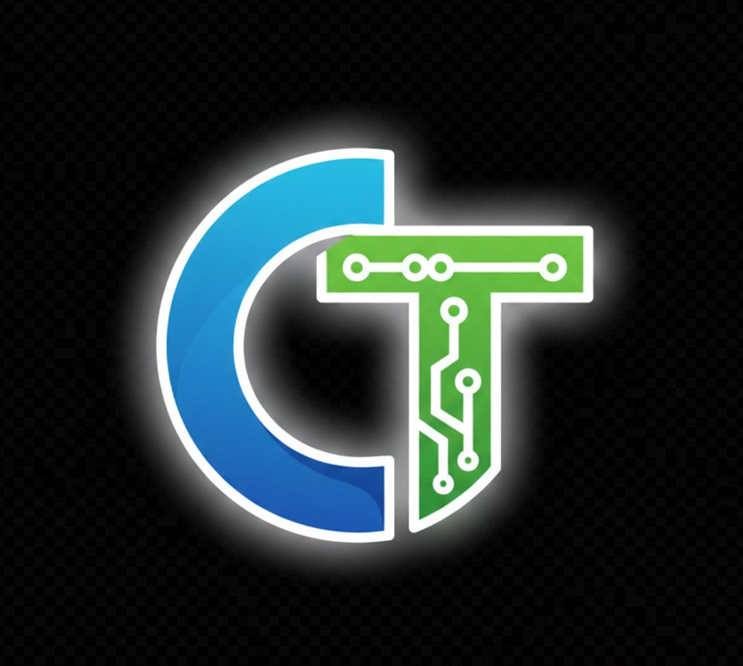

<p align="center">

</p>


# CareerTracker – MERN Stack Application

CareerTracker is a full-stack web application developed using the **MERN stack** (MongoDB, Express.js, React.js, Node.js).  
The project is designed to help users manage and track career goals, progress, and related activities in a structured way.

---

## 📌 Table of Contents
- Overview
- Tech Stack
- Project Architecture
- Installation
- Environment Configuration
- Running the Application
- Git & Version Control Notes
- Future Enhancements
- Author

---

## 📖 Overview
This project follows a **client–server architecture** where:
- The **frontend** is built using React (Vite)
- The **backend** is implemented using Node.js and Express.js
- **MongoDB** is used as the database
- REST APIs handle communication between frontend and backend

---

## 🧰 Tech Stack

### Frontend
- React.js (Vite)
- JavaScript (ES6+)
- HTML5
- CSS3

### Backend
- Node.js
- Express.js
- Mongoose

### Database
- MongoDB (Local or MongoDB Atlas)

### Tools & Utilities
- Git & GitHub
- npm
- VS Code

---

## 🏗️ Project Architecture
```
carrerTracker/
│
├── backend/
│ ├── src/
│ │ ├── config/ # Database configuration
│ │ │ └── db.js
│ │ ├── models/ # Mongoose schemas
│ │ ├── routes/ # API routes
│ │ ├── controllers/ # Business logic
│ │ └── server.js
| |__ uploads
│ ├── package.json
│ └── .env
│
├── src/ # Frontend source code
├── public/
├── package.json
├── vite.config.js
├── .gitignore
└── README.md
```

---

## ⚙️ Installation

### Step 1: Clone the repository
```bash
git clone https://github.com/Shobhansen/carrerTracker.git
cd carrerTracker
```

### Step 2: Install frontend dependencies
```
npm install
```
### Step 3: Install backend dependencies
```
cd backend
npm install
```
---
## 🔐 Environment Configuration
Create a .env file inside the backend directory:
```
PORT=5000
MONGO_URI=mongodb://127.0.0.1:27017/carrerTracker
```
---
## ▶️ Running the Application
###  Start Backend Server
```
cd backend
npm run dev
```
### Backend runs on:
```
http://localhost:5000
```
### Start Frontend Server
```
cd ..
npm run dev
```
### Frontend runs on:
```
http://localhost:5173
```
---
## 🧾 Git & Version Control Notes

- node_modules is excluded using .gitignore

- Dependencies are restored using npm install

- Environment variables are managed via .env

- Git is used for version control with GitHub as the remote repository


---
## 🚀 Future Enhancements

- Role-based access control

- Career analytics dashboard using AI & ML

- Deployment 

- Improved UI & UX

---
## 👨‍💻 Author
Shobhan Sen

MCA Student | MERN Stack Developer